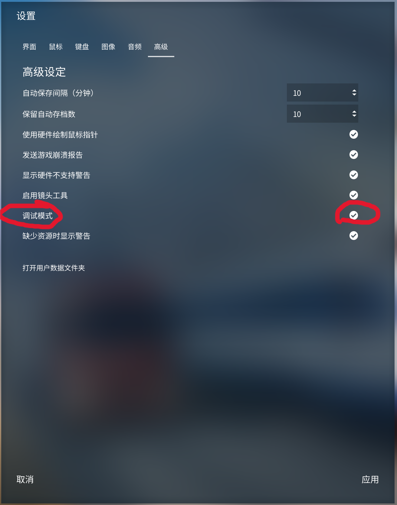
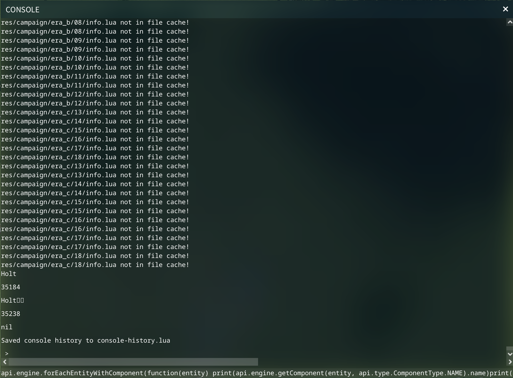

# 狂热运输2 时刻表mod自动录入
狂热运输2时刻表mod自动输入软件

## 安装
点击release，下载并解压即可

## 教程

1. **目录和存档**   
先选择根目录文件夹，这里是所有时刻表数据以及系统数据的存放地，再选择存档，它一般在“C:\\Program Files (x86)\\Steam\\userdata\\XXXX\\1066780\\local\\save\\xxx.lua”，取决于steam安装位置，如果找不到，可以进入游戏-设置-高级-打开用户数据文件夹  

2. **线路、站点id获取**   
程序基于底层的lua文件修改，因此需要知道存档内部的线路站点id    
打开游戏，设置里打开控制台选项    

重启游戏，然后进入存档，按`打开控制台，也可在设置里自行设置按键    
复制站点/数据代码，在控制台里粘贴并回车，可以看到出来了很多数据  

复制所有uil上面一直到你的代码那一行的数据，应该符合一行名字一行空格、一行数字一行空格的格式

名字有乱码是正常的    
复制好了文本，粘贴进界面左侧，选择站点导入或者线路导入    
线路允许进行截断，例如"G1/2 上海-北京"会被截断成"G1"，用于时刻表匹配   
导入成功后会生成存档名_station(line).xlsx，请根据需要修改他们，尤其是对应覆盖选项，见下文   
> 注意：同步时刻表时所有的数据要和这里导入的相匹配，如果有不匹配请自己修改数据不管是修改时刻表的数据还是_station、_line的数据，总之软件要正确的识别你的对应id  

3.**时刻表同步**    
接下来介绍模式：   
简单模式：根据_line内的线路数据依次寻找文件
    文件命名规则：例：Z1.xlsx，Z1_2.xlsx，Z1_3.xlsx ...诸如此类，
         同一线路不同时刻表请按照这个规则命名，\n"
         自动采用文件里的所有表单。\n"
列表模式：程序已自动生成存档名_list.xlsx，第一行数据请随意更改\n"
         从第二行开始，每一行一个线路，第一列为线路名称，\n"
         第二列开始，每两列分别为文件名、表单名，\n"
         多表单请用空格分隔，需要所有表单请空着，\n"
         可无限往后加，也可相同线路再单开一行。\n"

其余选项说明：\n"
xlsx，csv：顾名思义。csv仅支持UTF8格式，请在另存为界面寻找相关编码，csv列表模式忽略表单数据\n"

数据最后一行为无效数据：顾名思义。最后一行无效比较方便拉表。

时刻表堆叠：举例：一班车在60min内跑了一个交路三次，那么打开这个选项就会记录3组时刻表，否则是1组\n"

仅覆盖：仅覆盖检测到的所有时刻表，比如数据里仅有一个车次的时刻表那就只覆盖这个\n"
清空line后导入：检测所有line文件里的线路，删除这些线路的时刻表（如果存在）并导入\n"
               适合有其他非火车线路的时刻表时，设置好line里仅保存火车线路，清空火车线路时刻表并覆盖\n"
全部清空后导入：删除所有存在的时刻表并导入\n"

其他注意事项：\n"
所有时刻表格式应符合第二列为站点名称，第三、四列为到发时刻数据，其余数据并不读取，\n"
请保证站点和线路名称匹配，\n"
如果监测到有重复的时刻表数据，或者两组数据所有间隔小于5s，会默认合并重复的项目，并且在导入前提示，\n"
每次导入都会为上一次做一个备份，位置为存档文件夹，\n"
如需回档请直接修改文件名（请在文件夹界面查看-显示里打开文件名扩展），并copy回存档文件夹\n"
导入时刻表时请关闭游戏存档\n"
如果遇到了任何问题，请打开关于界面和我反馈，谢谢！b站私信和github均可\n";

## 许可证

本项目使用 [MIT License](LICENSE)。

## 第三方代码
- [QXlsx](https://github.com/QtExcel/QXlsx) - MIT License