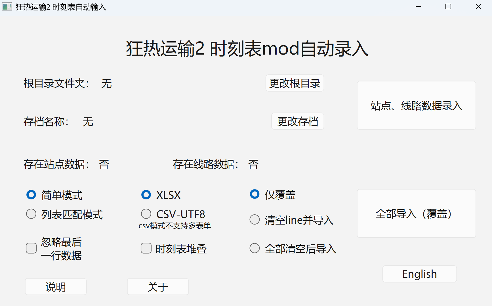

# 狂热运输2 时刻表 MOD 自动录入工具

[简体中文](./README.md) | [English](./README_en.md)

一个为《狂热运输2》玩家设计的自动化工具，可自动录入和管理游戏时刻表数据，节省手动配置时间。

##  功能特点

-  **格式导入**：将 Excel/CSV 格式的时刻表导入到游戏存档
-  **智能匹配**：自动识别线路和站点 ID，简单模式和列表模式
-  **批量处理**：支持多线路、多时刻表批量导入
  - **安全备份**：每次操作前自动备份存档，防止数据丢失

##  安装说明

 前往 [Release](https://github.com/zm0423/tpf2_autofill/releases)下载最新版本的压缩包，解压即可使用

## 基本步骤

 
<small><em>程序界面</em></small>

  
1.  **选择根目录文件夹**
    *   此文件夹用于存放所有时刻表数据及系统数据。
  
2.  **选择游戏存档文件**
    *   存档文件路径通常为：
        `C:\Program Files (x86)\Steam\userdata\XXXX\1066780\local\save\xxx.lua`
        （具体路径取决于您的 Steam 安装位置）。
    >   **提示**：也可在游戏中通过 **设置 → 高级 → 打开用户数据文件夹** 来定位。

3. **下载并安装辅助mod**
    *   打开创意工坊，下载“**时刻表自动录入程序辅助工具**”mod，在你的存档里启用，并保存至存档文件。

4.  **导入数据到软件**
    *   点击 **“站点导入”** 或 **“线路导入”** 按钮。
    *   可选择**覆盖**或者**仅添加**，推荐**覆盖**，排序友好。
    *   **关于线路**：软件支持对长线路进行截断操作，例如“G1/2 上海-北京”可以被截断为“G1”，便于时刻表文件的匹配和识别。可自定义截断字符。

    > **注意：**    
    > **数据一致性至关重要**：后续进行“同步时刻表”操作时，时刻表数据中的**站点名**和**线路名**，必须与这里导入的数据**完全匹配**（仅允许前后有空格）。
    >    **确保 ID 正确识别**：无论是直接修改时刻表文件，还是修改生成的 `_station.xlsx` 或 `_line.xlsx` 文件，最终目的都是为了让软件能通过名称**正确匹配到游戏内部的 ID**。如果遇到不匹配的情况，请自行核对并修改相关数据。
    >    **确保使用的数据无重复**：无论是线路还是站点，请确保使用到的数据是没有重复的。（如果这个数据不使用，那么重复是允许的）

    *   成功导入后，会生成 `存档名_station.xlsx` 和 `存档名_line.xlsx` 两个文件。
    *   请根据需要核对并修改上述文件中的数据。_line文件与**覆盖选项**有关，请注意更改。
       
5.  **确认导入模式后点击**
  
### 数据录入模式说明
  
#### 简单模式
*   **运行逻辑**：程序将根据 `_line.xlsx` 文件中的线路数据，自动寻找对应的时刻表文件。
*   **文件命名规则**：`线路名.xlsx`，或 `线路名_序号.xlsx`（例如：`Z1.xlsx`， `Z1_2.xlsx`）。
    *   同一线路的不同时刻表请按此规则连续命名。
    *   注意，首个文件请不要添加_1，编号从_2开始。
*   **表单处理**：自动采用文件内的 **所有表单**。
  
#### 列表模式
*   程序会自动生成 `存档名_list.xlsx` 文件。
    *   **第一行**：可随意更改（通常为标题或说明）。
    *   **第二行及以后**：每一行代表一条线路的导入配置。
    *   **第一列**：线路名称。
    *   **第二列开始**：每两列为一组，分别代表 **文件名** 和 **表单名**。
*   **多表单**：如需指定多个表单，请用 **空格** 分隔其名称。
*   **全部表单**：如需采用文件内所有表单，请将表单名留空。
*   可无限向右添加配置列，也可为同一线路另起一行配置。
  
### 覆盖选项说明
  

| 选项 | 说明 |
| :--- | :--- |
| **仅覆盖** | 仅覆盖检测到的现有时刻表（例如，若数据中只有一个车次的时刻表，则只覆盖该车次）。 |
| **清空line后导入** | 检测 `_line.xlsx` 中列出的所有线路，先删除这些线路的现有时刻表（如果存在），再导入新数据。**适用于**：当存档中存在非火车线路的时刻表时，可设置 `_line.xlsx` 只包含火车线路，从而仅清空并覆盖火车时刻表。 |
| **全部清空后导入** | 删除存档中 **所有** 现有的时刻表，然后导入新数据。 |

  
### 其他选项说明
  

| 选项 | 说明 |
| :--- | :--- |
| **xlsx, csv** | 选择导入文件的格式。**注意**：`csv` 仅支持 UTF-8 编码（请在另存为界面选择），且在列表模式下会忽略表单名。 |
| **忽略最后一行数据** | 勾选后，程序将忽略数据表的最后一行。 |
| **时刻表堆叠** | **举例**：若一班车在 60 分钟内跑了 3 个相同的交路，开启此选项将记录 3 组时刻表，关闭则只记录 1 组。 |
  

## 注意事项与格式要求
  
1.  **时刻表格式**：
    *   必须保证 Excel 文件的 **第二列** 为站点名称，**第三、四列** 分别为到站、发车时刻。
    *   程序仅读取这三列数据，其余列不影响导入。

2.  **名称匹配**：
    *   请确保时刻表中的 **站点名** 和 **线路名**，与游戏存档中的数据 **完全匹配**（仅允许前后相差有空格）。
    *   无论是线路还是站点，**请确保使用的数据是无重复的**。（如果这个数据不使用，那么重复是允许的）

3.  **重复数据处理**：
    *   如果检测到完全重复的时刻表数据，或两组数据的到/发车时间间隔小于 5 秒，程序会 **自动合并** 这些重复项，并在导入前给出提示。

4.  **备份与安全**：
    *   每次导入都会自动为上一次的数据创建一个备份，存放在存档文件夹内（steam/userdata/...）。
    *   **回档方法**：找到备份文件，修改其文件名（移除备份标记），然后复制回存档文件夹覆盖即可。（操作前请在系统文件夹选项中开启“文件扩展名”显示）。

5.  **重要操作前提**：
    *   **导入时刻表时，请务必关闭游戏或确保存档未处于加载状态。**

### 获取帮助
遇到问题请通过以下方式反馈：

- **GitHub Issues**：提交问题
- **B站**：[https://space.bilibili.com/352468871](https://space.bilibili.com/352468871)
- **邮箱**：15800733391@163.com
  
## 许可证

本项目使用 [MIT License](LICENSE)。

## 第三方代码
- [QXlsx](https://github.com/QtExcel/QXlsx) - MIT License

