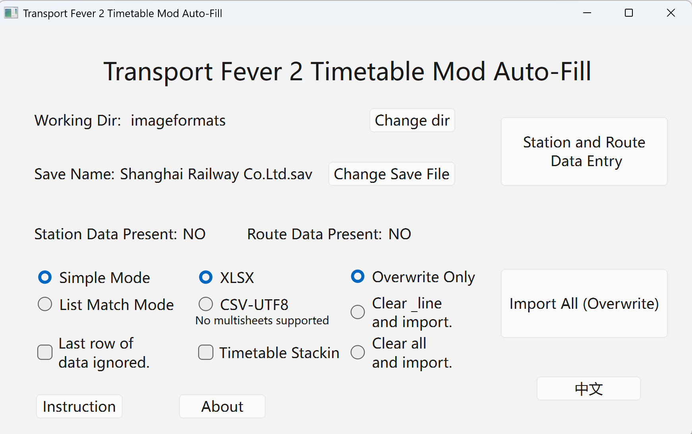

# Transport Fever 2/3 Timetable Mod AutoFill Tool

[English](./README.md) | [简体中文](./README_zh.md)

An automation tool designed for *Transport Fever 2 / Transport Fever 3* players to automatically import and manage in-game timetable data, saving time on manual configuration.

## Features
- **Format Import**: Import timetables from Excel/CSV files directly into game save files.
- **Dual-Version Support**: Compatible with *Transport Fever 2* and *Transport Fever 3*; TPF3 syncs data in real time through the “Timetable AutoFill” bridge mod.
- **Intelligent Matching**: Automatically identifies route and station IDs using Simple or List Match modes.
- **Batch Processing**: Supports batch imports for multiple routes and timetables.
- **Safe Backup**: Backs up the save file automatically before each operation in TPF2 to prevent data loss (TPF3 has no save file and no backup — see below).

## Installation
Go to the [Releases](https://github.com/zm0423/tpf2_autofill/releases) page, download the latest version's compressed package, and extract it to use.

## Basic Steps

 
<small><em>Interface</em></small>

1.  **Select Root Directory Folder**
    *   This folder is used to store all timetable data and system files.

2.  **Select Game Save File (no save file in TPF3 — see details below)**
    *   The default save file path is typically:
        `C:\Program Files (x86)\Steam\userdata\XXXX\1066780\local\save\xxx.lua`
        (Depends on your Steam installation location).
    >   **Tip**: You can also locate it in-game via **Settings → Advanced → Open User Data Folder**.
    >   **TPF3 Tip**: TPF3 mode does not require selecting a save file; the data folder is detected automatically. See “Transport Fever 3 (TPF3) Special Notes” below.

3. **Download and activate assist mod**
   - **TPF2**: Download the "**Timetable AutoFill Program Assist Tool**" mod in the workshop. Activate it in your save game and save it.
   - **TPF3**: Open the in-game **Mod Hub** and subscribe to and enable the "**Timetable AutoFill**" mod on mod.io.

4.  **Import Data into the Software**
    *   Click either the **"Station Import"** or **"Route Import"** button based on your needs.
    *   Select either **Overwrite** or **Add only**. **Overwrite** is recommended becasue it is better in auto sorting.
    *   **About Routes**: The software supports truncating long route names. For example, "G1/2 Shanghai-Beijing" can be truncated to "G1" to facilitate matching with timetable files. The truncation character can be customized.

    > **Important:**     
    > **Data Consistency is Crucial**: When performing the "Synchronize Timetables" operation later, the **station names** and **route names** in your timetable data must **exactly match** the data imported here (only leading/trailing spaces are allowed).     
    > **Ensure Correct ID Recognition**: Whether you directly modify the timetable files or the generated `_station.xlsx` / `_line.xlsx` files, the ultimate goal is for the software to **correctly match names to the internal game IDs**. If mismatches occur, please check and modify the relevant data yourself.     
    > **Make sure the data you actually use is unique**: No matter line or station, if you use this name in your timetable data, make sure it is unique.(If you do not use that station or line, duplicate is allowed)

    *   After successful import, two files will be generated: `[SaveName]_station.xlsx` and `[SaveName]_line.xlsx`.
    *   Please verify and modify the data in these files as needed. Changes to the `_line` file affect the **Overwrite Options**.

5.  **Confirm Import Mode and Click Start**

### Data Import Mode Description

#### Simple Mode
*   **Logic**: The program automatically searches for corresponding timetable files based on route data in the `_line.xlsx` file.
*   **File Naming Convention**: `[RouteName].xlsx`, or `[RouteName]_[Index].xlsx` (e.g., `Z1.xlsx`, `Z1_2.xlsx`).
    *   Different timetables for the same route should be named consecutively using this rule.
    *   **Note**: Do not add `_1` to the first file; numbering starts from `_2`.
*   **Sheet Handling**: Automatically uses **all sheets** within the file.

#### List Match Mode
*   The program automatically generates a `[SaveName]_list.xlsx` file.
    *   **First Row**: Can be changed freely (usually for a title or description).
    *   **Second Row Onwards**: Each row represents an import configuration for one route.
    *   **First Column**: Route name.
    *   **Second Column Onwards**: Every two columns form a pair, representing **Filename** and **Sheet Name**.
*   **Multiple Sheets**: To specify multiple sheets, separate their names with a **space**.
*   **All Sheets**: To use all sheets within a file, leave the sheet name cell **empty**.
*   You can add configuration pairs indefinitely to the right, or add a new row for the same route.

### Overwrite Options Description

| Option | Description |
| :--- | :--- |
| **Overwrite Only** | Only overwrites existing timetables that are detected (e.g., if the data contains a timetable for only one train, only that train's timetable will be overwritten). |
| **Clear _line and Import** | Detects all routes listed in `_line.xlsx`, first deletes their existing timetables (if any), then imports new data. **Use case**: When a save contains timetables for non-train routes, you can configure `_line.xlsx` to include only train routes, thereby clearing and overwriting only train timetables. |
| **Clear All and Import** | Deletes **all** existing timetables in the save, then imports new data. |

### Other Options Description

| Option | Description |
| :--- | :--- |
| **xlsx, csv** | Select the format of the import files. **Note**: `csv` only supports UTF-8 encoding (choose this option in the 'Save As' dialog), and sheet names are ignored in List Match Mode. |
| **Ignore Last Data Row** | When checked, the program will ignore the last row of the data table. |
| **Timetable Stacking** | **Example**: If a train runs 3 identical round trips within 60 minutes, **enabling** this option stacks the 3 trips into 3 separate timetables; **disabling** it records all 3 trips as one complete line. |
| **Compatibility Version** | Select the data format matching your installed timetable mod: **"Timetable & Train Diagram, Timetable 1.2"** stores line IDs as string keys, while **"Timetable 1.3-1.5"** uses numeric keys. During import, all line entries in the save will be migrated to the selected key format automatically. **Make sure the choice matches your mod, otherwise the game will fail to load the timetables.** |

## Transport Fever 3 (TPF3) Special Notes

Click the **“Switch to TPF3”** button in the top-right corner to switch (the choice is remembered). Data exchange in TPF3 is quite different from TPF2, so please read the following carefully:

1.  **Install the assist mod**
    *   Subscribe to and enable the **“Timetable AutoFill”** mod from mod.io in the in-game **Mod Hub**.

2.  **Usage**
    *   We recommend starting the game and loading a save first, then opening this program; data exchange is **real-time**, so there is no need to re-enter the game after importing like in TPF2.
    *   TPF3 has **no save file concept**; the program detects the current in-game save in real time. If you switch saves, click **“Refresh”** after the save has finished loading.
    *   Make sure the current save matches the data in the folder: the TPF3 working files are named `tpf3_timetable_station.xlsx`, `tpf3_timetable_line.xlsx` and `tpf3_timetable_list.xlsx`; **keep different saves in different folders**.

3.  **Full workflow**
    *   Load the game save → open this program → import stations and routes (again, no need to do this every time) → import the timetable data → click **“Apply Imported Data to Timetables”** in the in-game mod window to finish.

4.  **New stations or routes added mid-game**
    *   First click the in-game **“Export Save Station/Line Data”** button, then re-import the station and route data in the program.

5.  **No backup**
    *   There is no save file in TPF3, so there is **no backup**; please make sure the data is correct before saving your game!

6.  **Cycle (hours)**
    *   TPF3 has a **global cycle (hours)** concept (1/2/3/6/12/24 hours), selected in the “Compatibility Version” section; the hours part of “H:MM:SS” in the timetable counts into total minutes (offset within the cycle).
    *   An hour overflow will raise an error.

7.  **Multiple accounts**
    *   If you play Transport Fever with multiple Steam accounts and use timetables, please select the account manually (in the **“Current Steam user”** row of the “Path” section).
    *   If there is only one account, or only one account plays TPF3 timetables, the account is locked automatically and no manual selection is needed.

8.  **Problems**
    *   If you run into any problems, please contact the author immediately.

## Important Notes and Format Requirements

1.  **Timetable Format**:
    *   The **second column** of the Excel file must contain station names, and the **third and fourth columns** must contain arrival and departure times, respectively.
    *   The program only reads data from these three columns; other columns do not affect the import.

2.  **Name Matching**:
    *   Ensure that **station names** and **route names** in the timetable files **exactly match** the data from the game save (only leading/trailing spaces are allowed).
    *   **Make sure the data you actually use is unique**: No matter line or station, if you use this name in your timetable data, make sure it is unique.(If you do not use that station or line, duplicate is allowed)

3.  **Duplicate Data Handling**:
    *   If completely duplicate timetable data is detected, or if the arrival/departure times between two sets of data differ by less than 5 seconds, the program will **automatically merge** these duplicates and prompt you before import.

4.  **Backup and Safety (TPF2)**:
    *   Each import automatically creates a backup of the previous data, stored within the save folder(steam/userdata...).
    *   **How to Restore**: Locate the backup file, rename it (remove the backup marker), then copy it back to the save folder to overwrite the current file. (Ensure "File name extensions" are visible in your system's folder options before proceeding).
    *   **TPF3 note**: TPF3 has no save file, so there is no backup; please make sure the data is correct before saving.

5.  **Critical Prerequisite**:
    *   **TPF2**: Ensure the game is closed or the save file is not loaded when importing timetables.
    *   **TPF3**: Keep the game running with a save loaded (the program exchanges data with the game in real time).

### Getting Help
If you encounter any issues, please provide feedback through:

- **GitHub Issues**: Submit problems or suggestions.
- **Bilibili**: [https://space.bilibili.com/352468871](https://space.bilibili.com/352468871)
- **Email**: 15800733391@163.com

## License
This project is licensed under the [MIT License](LICENSE).

## Third-Party Code
- [QXlsx](https://github.com/QtExcel/QXlsx) - MIT License
