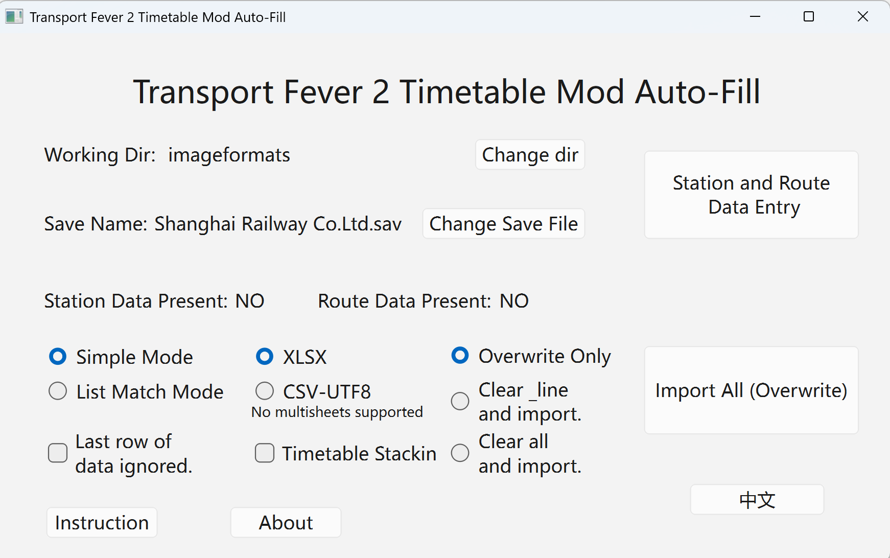
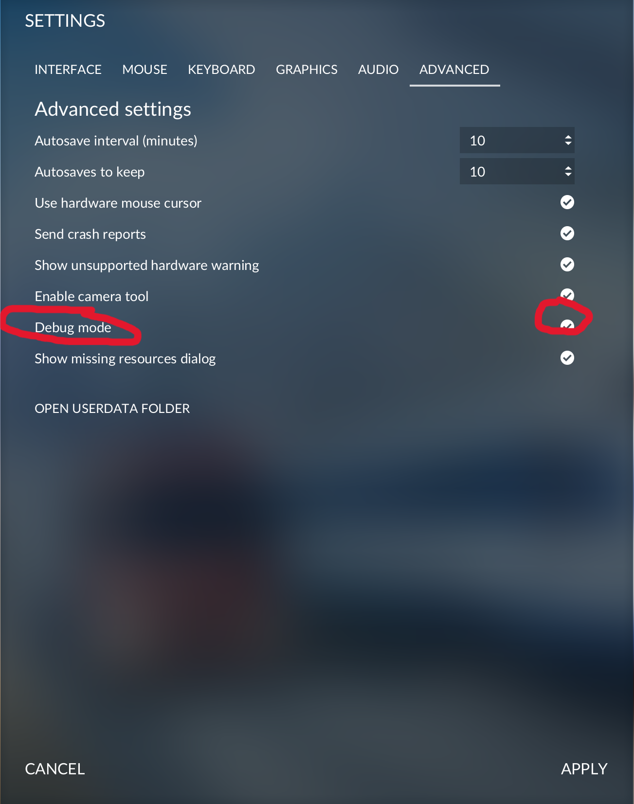
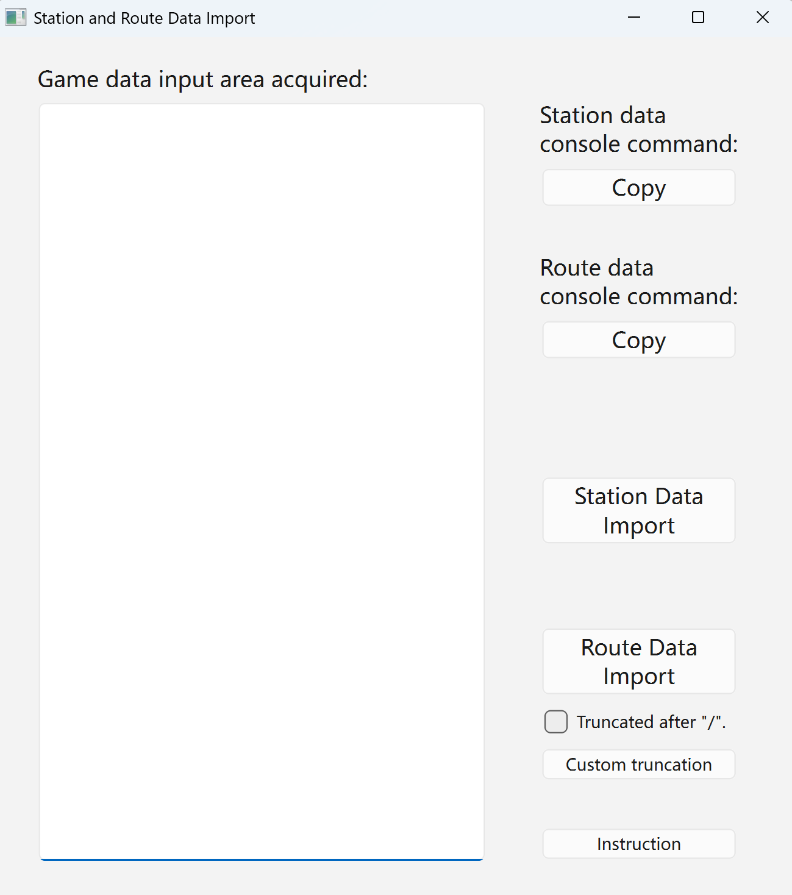
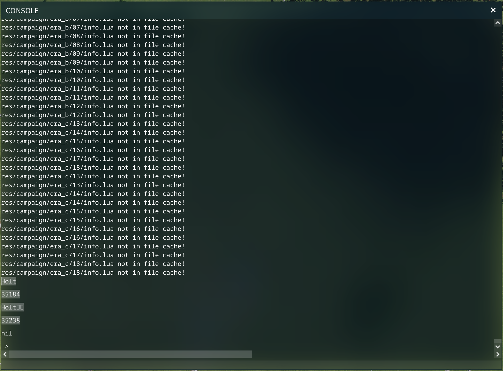

# Transport Fever 2 Timetable Mod Auto-Entry Tool

[简体中文](./README.md) | [English](./README_en.md)

An automation tool designed for *Transport Fever 2* players to automatically import and manage in-game timetable data, saving time on manual configuration.

## Features
- **Format Import**: Import timetables from Excel/CSV files directly into game save files.
- **Intelligent Matching**: Automatically identifies route and station IDs using Simple or List Match modes.
- **Batch Processing**: Supports batch imports for multiple routes and timetables.
- **Safe Backup**: Automatically backs up the save file before each operation to prevent data loss.

## Installation
Go to the [Releases](https://github.com/zm0423/tpf2_autofill/releases) page, download the latest version's compressed package, and extract it to use.

## Basic Steps

 
<small><em>Interface 1</em></small>

1.  **Select Root Directory Folder**
    *   This folder is used to store all timetable data and system files.

2.  **Select Game Save File**
    *   The default save file path is typically:
        `C:\Program Files (x86)\Steam\userdata\XXXX\1066780\local\save\xxx.lua`
        (Depends on your Steam installation location).
    >   **Tip**: You can also locate it in-game via **Settings → Advanced → Open User Data Folder**.

3.  **Enable Game Debug Mode**
    *   Enter the game, open **Settings → Advanced**.
    *   Enable **Debug Mode**.
    *   **Restart the game** for the setting to take effect, then load your save.
    

    
    

4.  **Open Console and Execute Command**
    *   Press the **\`** key (backtick) in-game to open the console. (This key can be customized in game settings).
    

     
    <small><em>Interface 2</em></small>
    

    *   Copy the provided console command, paste it into the console, and press **Enter** to execute.
    

    
    

5.  **Copy and Process Output Data**
    *   After execution, the console will display a large amount of data.
    *   **Copy all text** from the console, starting from the line **above the `uil` text** and ending **just before the command line you pasted**.
    **Example Screenshot:**
    

    
    

    *   **Correct Data Format**: Should follow the pattern: one name line, one blank line, one number (ID) line, one blank line... repeating.
    *   **Note**: Garbled characters in names are normal if your language is not ASCII.

6.  **Import Data into the Software**
    *   Paste all the text copied in the previous step into the **left input box** of this software's interface.
    *   Click either the **"Station Import"** or **"Route Import"** button based on your needs.
    *   **About Routes**: The software supports truncating long route names. For example, "G1/2 Shanghai-Beijing" can be truncated to "G1" to facilitate matching with timetable files. The truncation character can be customized.

    > **Important:**
    > **Data Consistency is Crucial**: When performing the "Synchronize Timetables" operation later, the **station names** and **route names** in your timetable data must **exactly match** the data imported here (only leading/trailing spaces are allowed).
    > **Ensure Correct ID Recognition**: Whether you directly modify the timetable files or the generated `_station.xlsx` / `_line.xlsx` files, the ultimate goal is for the software to **correctly match names to the internal game IDs**. If mismatches occur, please check and modify the relevant data yourself.

    *   After successful import, two files will be generated: `[SaveName]_station.xlsx` and `[SaveName]_line.xlsx`.
    *   Please verify and modify the data in these files as needed. Changes to the `_line` file affect the **Overwrite Options**.

7.  **Confirm Import Mode and Click Start**

### Data Import Mode Description

#### Simple Mode
*   **Logic**: The program automatically searches for corresponding timetable files based on route data in the `_line.xlsx` file.
*   **File Naming Convention**: `[RouteName].xlsx`, or `[RouteName]_[Index].xlsx` (e.g., `Z1.xlsx`, `Z1_2.xlsx`).
    *   Different timetables for the same route should be named consecutively using this rule.
    *   **Note**: Do not add `_1` to the first file; numbering starts from `_2`.
*   **Sheet Handling**: Automatically uses **all sheets** within the file.

#### List Match Mode
*   The program automatically generates a `[SaveName]_list.xlsx` file.
    *   **First Row**: Can be changed freely (usually for a title or description).
    *   **Second Row Onwards**: Each row represents an import configuration for one route.
    *   **First Column**: Route name.
    *   **Second Column Onwards**: Every two columns form a pair, representing **Filename** and **Sheet Name**.
*   **Multiple Sheets**: To specify multiple sheets, separate their names with a **space**.
*   **All Sheets**: To use all sheets within a file, leave the sheet name cell **empty**.
*   You can add configuration pairs indefinitely to the right, or add a new row for the same route.

### Overwrite Options Description

| Option | Description |
| :--- | :--- |
| **Overwrite Only** | Only overwrites existing timetables that are detected (e.g., if the data contains a timetable for only one train, only that train's timetable will be overwritten). |
| **Clear _line and Import** | Detects all routes listed in `_line.xlsx`, first deletes their existing timetables (if any), then imports new data. **Use case**: When a save contains timetables for non-train routes, you can configure `_line.xlsx` to include only train routes, thereby clearing and overwriting only train timetables. |
| **Clear All and Import** | Deletes **all** existing timetables in the save, then imports new data. |

### Other Options Description

| Option | Description |
| :--- | :--- |
| **xlsx, csv** | Select the format of the import files. **Note**: `csv` only supports UTF-8 encoding (choose this option in the 'Save As' dialog), and sheet names are ignored in List Match Mode. |
| **Ignore Last Data Row** | When checked, the program will ignore the last row of the data table. |
| **Timetable Stacking** | **Example**: If a train runs 3 identical schedules within 60 minutes, enabling this option will record 3 timetables; disabling it will record only 1. |

## Important Notes and Format Requirements

1.  **Timetable Format**:
    *   The **second column** of the Excel file must contain station names, and the **third and fourth columns** must contain arrival and departure times, respectively.
    *   The program only reads data from these three columns; other columns do not affect the import.

2.  **Name Matching**:
    *   Ensure that **station names** and **route names** in the timetable files **exactly match** the data from the game save (only leading/trailing spaces are allowed).

3.  **Duplicate Data Handling**:
    *   If completely duplicate timetable data is detected, or if the arrival/departure times between two sets of data differ by less than 5 seconds, the program will **automatically merge** these duplicates and prompt you before import.

4.  **Backup and Safety**:
    *   Each import automatically creates a backup of the previous data, stored within the save folder(steam/userdata...).
    *   **How to Restore**: Locate the backup file, rename it (remove the backup marker), then copy it back to the save folder to overwrite the current file. (Ensure "File name extensions" are visible in your system's folder options before proceeding).

5.  **Critical Prerequisite**:
    *   **Ensure the game is closed or the save file is not loaded when importing timetables.**

### Getting Help
If you encounter any issues, please provide feedback through:

- **GitHub Issues**: Submit problems or suggestions.
- **Email**: 15800733391@163.com

## License
This project is licensed under the [MIT License](LICENSE).

## Third-Party Code
- [QXlsx](https://github.com/QtExcel/QXlsx) - MIT License